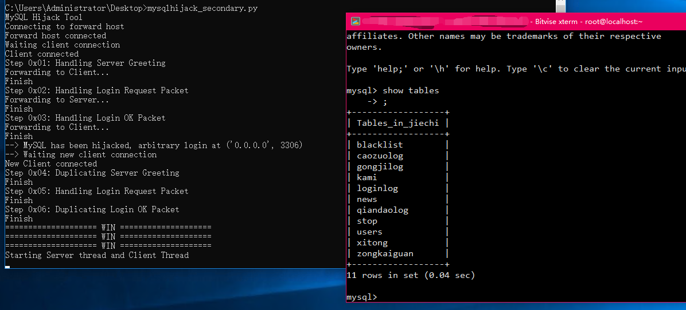

# MySQL Session Hijacker
Simple python script to hijack any local MySQL Connection without their username & password.

U can use this to hack some softwares which used their MySQL Server as account server directly.

It's easy and nothing need to say. Just see below image.

# MySQL Session Hijacker (Chinese Version)
一个可以劫持本地任意MySQL连接的小python脚本.

遇到直接连接MySQL数据库当账号服务器的软件, 不用再去逆向软件当中的MySQL用户名和密码了.

很简单的小东西, 没有什么需要多说的. 看看下面的截图就知道了.

# modify by bakabie

稍微修改了下47的，用法更简单

先运行`fake_socks.py`创建个socks5服务器，然后用`profixer`把你要劫持的目标会话重定向到fake socks5上面

然后修改fake_socks5里的mysql_secondary 监听的地址，然后`mysql_secondary`再设置FORWARDHOST为远程目标即可。

劫持成功后，等待`Waiting new client connection`出现后用mysqlcli任意密码登陆mysql_secondary即可

请一定要用非`FAKE_SOCKS5_HOST`的客户端去连接`mysql_secondary`，否则会被当成被劫持的客户端请求给忽略掉！

请一定要用非`FAKE_SOCKS5_HOST`的客户端去连接`mysql_secondary`，否则会被当成被劫持的客户端请求给忽略掉！

请一定要用非`FAKE_SOCKS5_HOST`的客户端去连接`mysql_secondary`，否则会被当成被劫持的客户端请求给忽略掉！

关于`FAKE_SOCKS5_HOST`，如果你`fake_socks`和`mysql_secondary`在同一个机器上，请设置为`127.0.0.1`，否则请设置为fake_socks5部署的主机地址

# Screenshot

